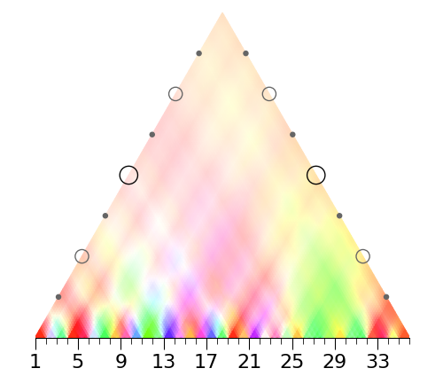

# wavescapes


Wavescapes are plots that can visually represent measurements of regularity in music. Those measurements are represented by colors, which are ordered in a hierarchical manner in the plot allowing for all possible subsections of a musical piece to have their measurement being displayed on the plot. The regularity is measured through the Discrete Fourier Tansform (DFT). Interpretation of the different components outputed by the DFT with respect to the soure musical piece allow high-level analysis of the tonality in the hierarchy of the piece. A publication describing the methodology and many use cases of this visual tool will be published in the future.


### Installation

To install this package the following command has to be issued on a terminal prompt:

```bash
pip install wavescapes
```

Depending on which default python distribution you have, `pip3` instead of `pip` might be used. Regardless, you need to be aware this library only works with a version of python that is 3.7 or higher.

Below is the list of packages required in order for this library to work. Link to the package's official webpage, and a short description of its usage in this project is specified. Explanations on how to install each of these can be found on each package's hyperlink.

* [numpy](https://numpy.org/) used for vector operations, the DFT operations, and in order to model the wavescapes as a matrix of colored values. 
* [music21](https://web.mit.edu/music21/) used to parse MIDI files and get temporal and pitch informations from them.
* [pretty_midi](https://github.com/craffel/pretty-midi) only used in order to remove percussive tracks for MIDI files.
* [matplotlib](https://matplotlib.org/) the main graphic library. 
* [scipy.io.wavfile](https://kite.com/python/docs/scipy.io.wavfile) used for real audio processing, converts a wav file into an array of raw audio values.
* [librosa](https://librosa.github.io/librosa/) used to produce chromagrams (i.e. pitch class distributions) from real audio.


### documentation

TBD.


### usage
If all functions and classes from this package are correctly imported, the short snippet below is an example on how to generate a wavescape plot from a MIDI file and save it as a PNG file.

```python
from wavescapes import *
from matplotlib import pyplot as plt

# transforms the MIDI Files into a list of pitch class distribution, each corresponding to a slice of one quarter note from the file.
pc_mat = produce_pitch_class_matrix_from_filename(filepath = 'Bach Prelude in C Major (BWV 846).mid', aw_size = 1.)

# the DFT is applied to each of the pitch class distribution
fourier_mat = apply_dft_to_pitch_class_matrix(pc_mat)

# only the third Fourier coefficient is kept from the previous result and the matrix holding all color coded measurement is built
coeff_mat = complex_utm_to_ws_utm(fourier_mat, coeff=3)

# an instance of a class that allows the drawing of the previous matrix of colors is produced with the resolution being indicated as 500 pixels in width.
ws = Wavescape(coeff_mat, pixel_width=500)

# this draw the plot as an matplotlib figure. If called on a noteboot, this will display the figure at the end of the cell.
ws.draw(tick_ratio=4)

# saves the figure drawn as PNG image.
plt.savefig('bach_3rd_coeff_wavescape.png')
```


